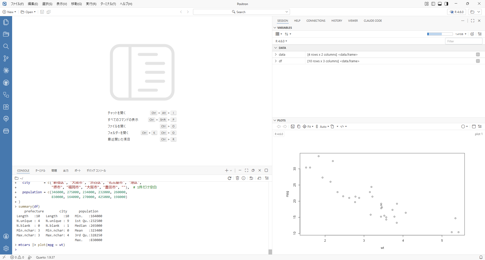

:::{.callout-note}
Windows版では、R 4.6.0がリリースされましたが、Linux版、Mac版はまだバイナリが提供されていないようです。本記事もLinux上で書いていますので、実行結果を直接記載できていませんが、Windows上で確認した内容をもとに書いています。
:::

## R 4.6.0が4月24日にリリース

昨日（4月24日）、Rの新しいバージョン4.6.0がリリースされました！時差の関係で日本ではほとんど25日にリリースされたようなものですが、早速今回のアップデートの内容について簡単に見ていきたいと思います。

## `%notin%`演算子の追加

個人的にはこれが一番大きい！Rのベースパッケージに、`%notin%` 演算子が追加されました。これは、`%in%` の否定バージョンで、ある要素がベクトルに含まれていないかどうかを簡単にチェックできるようになります。

例えば…

```r
x <- c(1, 2, 3)
y <- c(2, 3, 4)
x %notin% y
#> [1]  TRUE FALSE FALSE
```

詳しく見てみると、Xの要素のうち、1はYに含まれていないためTRUE、2と3はYに含まれているためFALSEとなっています。`y %notin% x` とすると、4がXに含まれていないため`FALSE FALSE TRUE`となります。

これまでは、`!(x %in% y)` と書いていたのが、より直感的に書けるようになりました！

### `filter()`での応用

`dplyr`の`filter()`関数と組み合わせると、特定の条件に合わない行を簡単に抽出できます。

例えば、以下のようなデータフレームがあるとします。

```r
library(dplyr)
df <- data.frame(
  id = 1:5,
  value = c("A", "B", "C", "D", "E")
)
```

ここで`value`が"B"と"D"であるものは除外したい場合、これまで`!(value %in% c("B", "D"))`と書いていたところ、

```r
df |> filter(value %notin% c("B", "D"))
#>   id value
#> 1  1     A
#> 2  3     C
#> 3  5     E
```

として、よりシンプルに書けるようになりました。

小さいデータフレームなのであまり効果を実感できないかもしれませんが、複数の条件付けをする場合などに`!`を使った否定形が多くなるとコードが読みづらくなってしまうことがあるので、`%notin%`の導入は非常に有用だと考えています。

## `summary()`関数の改善

一般的によく使われる`summary()`関数に関して、文字列列の要約が改善されました。

例えば以下のようなデータフレームがある都市ます。

```r
df <- data.frame(
  prefecture = c("東京都", "大阪府", "東京都", "愛知県", "東京都",
                 "大阪府", "福岡県", "大阪府", "愛知県", "東京都"),
  city       = c("新宿区", "大阪市", "渋谷区", "名古屋市", "港区",
                 "堺市", "福岡市", "大阪市", "豊田市", ""),  # 1件だけ空白
  population = c(346000, 275000, 234000, 232000, 260000,
                 830000, 164000, 270000, 425000, 198000)
)
```

R 4.5.0の場合、

```r
summary(df)
#>   prefecture            city             population
#>  Length:10          Length:10          Min.   :164000
#>  Class :character   Class :character   1st Qu.:232500
#>  Mode  :character   Mode  :character   Median :265000
#>                                        Mean   :323400
#>                                        3rd Qu.:328250
#>                                        Max.   :830000
```

となり、文字列の列に関してはほぼ情報量がゼロです。

R 4.6.0では、文字列列の要約が改善され、以下のように表示されるようになりました。

```r
summary(df)
#>      prefecture        city      population
#>  Length   :10   Length   :10   Min.   :164000
#>  N.unique : 4   N.unique : 9   1st Qu.:232500
#>  N.blank  : 0   N.blank  : 1   Median :265000
#>  Min.nchar: 3   Min.nchar: 0   Mean   :323400
#>  Max.nchar: 3   Max.nchar: 4   3rd Qu.:328250
#>                                Max.   :830000
```

このように、文字列列に対しても、ユニークな値の数や空白の数、最小・最大文字数などの情報が表示されるようになりました。

異常値の有無の確認がやりやすくなったのではないかと感じており、自分の仕事でも出番が来るのではないかなと思ったところです。

## その他の変更点

基本的にすぐ役立ちそうだなと思ったのは以上の2点で、あと挙げるとすれば`plot()`関数がパイプで使いやすくなったことでしょうか。

以前は`df |> plot(col2 ~ col1, data = _) `のように、データフレームをパイプで渡すときに、`data = _`と書いてあげる必要がありましたが、R 4.6.0では、`df |> plot(col2 ~ col1)`のように、`data = _`を省略して書けるようになりました。

```r
mtcars |> plot(mpg ~ wt)
```



## おわりに

今回は、R 4.6.0のリリースに伴う主な変更点について見てきました。

特に、`%notin%`演算子の追加と、`summary()`関数の改善は、日常的にRを使う上で非常に便利な機能だと思います。

早速アップデートして使っていきましょう👊

## 参考

