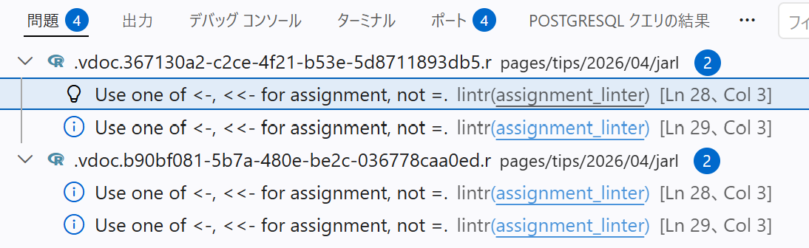
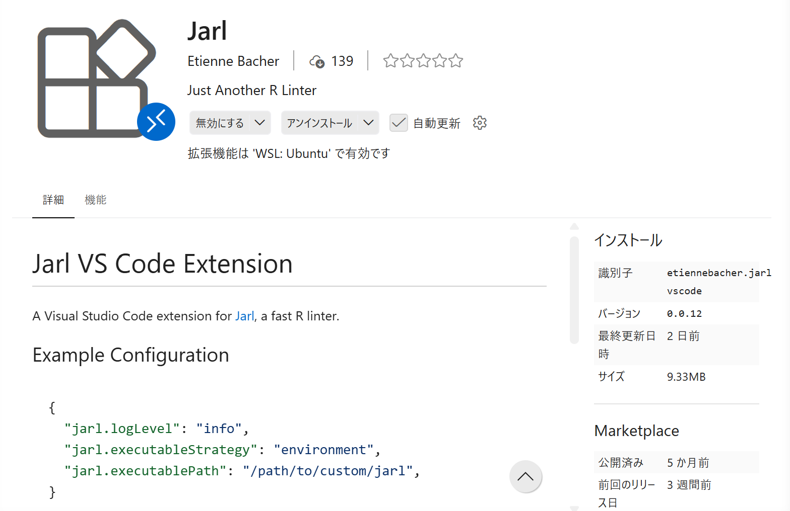
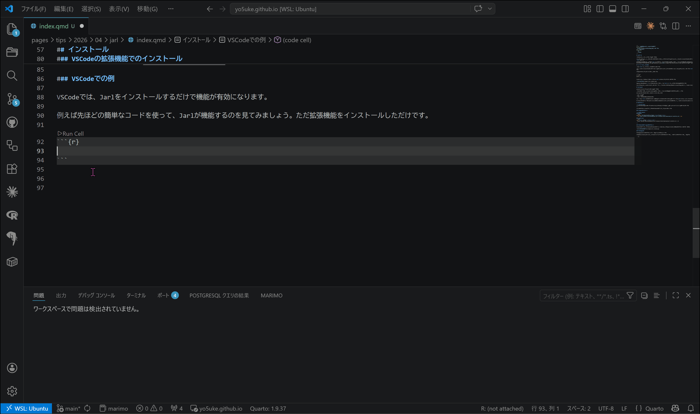

## はじめに

皆さん、リンターを使っていますでしょうか。

おそらく多くの方は使ったことがあるというか知らぬ間に使っていると思うのですが、リンターとはコードの品質をチェックするツールのことであり、これまでリンターの代表格といえば`lintr`でした。

しかし最近、新しいリンターとして`Jarl`が登場し、これも例のごとくRustで書かれているため、非常に高速であると評判です^[例のごとくというのは、これまでPolarsやuvといったRust製のツールを紹介してきたからです。気になった方は[こちら](/pages/tips/2026/01/polars/index.qmd)などをご覧ください！]。

## そもそもリンターとは？

まずは`lintr`を使ってリンターについて説明します。

リンターはコードの品質をチェックするツールであり、コードのスタイルや構文エラー、潜在的なバグなどを検出します。`lintr`はRのコードを解析し、これらの問題を指摘してくれます。

例えば、以下のようなコードがあったとします。

```r
x = 1:10
y = x^2
plot(x, y)
```

このコードは基本的には問題ありませんが、`lintr`は以下のような警告を出してきます。



Rでは、変数の代入には`<-`を使うことが推奨されているため、`lintr`は`=`を使っていることを指摘しています。

このように、リンターはコードのスタイルを統一するためのガイドラインを提供し、コードの品質を向上させるためのツールと思っていただければと思います。

## Jarlの特徴

では、Jarlはどのような特徴があるのでしょうか。

まずは冒頭にも書いた通り、JarlはRustで書かれているため、非常に高速であるという点が挙げられます。

dplyrパッケージ（約25,000行）に20ルールを適用した場合…

- Jarl: 0.131秒
- flir: 4.5秒
- lintr: 18.5秒（キャッシュあり9秒）

と、一般的な`lintr`と比較して約140倍の速度でコードをチェックすることができます^[参考：[Jarl](https://jarl.etiennebacher.com/)]。

さらに、自動修正機能もあり、コードの保存時に自動的にコードのスタイルを修正してくれるため、コードの品質を保つのが非常に簡単になります。

## インストール

:::{.callout-note}
今回はVSCodeの例で説明しますが、PositronなどVSCodeベースのエディタであれば同様の機能が利用できると思います。
:::

Jarlのインストールは、CLIを使うか、VSCodeの拡張機能を使う方法があります。

### CLIでのインストール

:::{.panel-tabset}
### Windows
```bash
powershell Set-ExecutionPolicy Bypass -Scope Process -Force; `
   iwr https://github.com/etiennebacher/jarl/releases/latest/download/jarl-installer.ps1 | iex
```
### macOS/Linux
```bash
curl --proto '=https' --tlsv1.2 -LsSf \
  https://github.com/etiennebacher/jarl/releases/latest/download/jarl-installer.sh | sh
```
:::

### VSCodeの拡張機能でのインストール

VSCodeの拡張機能を使う場合は、VSCodeの拡張機能マーケットプレイスで「Jarl」を検索し、インストールしてください。



### VSCodeでの例

VSCodeでは、Jarlをインストールするだけで機能が有効になります。

例えば先ほどの簡単なコードを使って、Jarlが機能するのを見てみましょう。ただ拡張機能をインストールしただけです。



いかがでしょうか？保存したときに自動的にコードのスタイルが修正されているのがわかると思います。

Jarlを使えば、コードのスタイルを簡単に統一することができます。

## おわりに

今回は新しいRのリンター、Jarlについて紹介しました。Jarlは高速で自動修正機能もあるため、コードの品質を向上させるのに非常に便利なツールです。

以前紹介したRのフォーマッターである`Air`と組み合わせて使うことで、コードのスタイルをさらに簡単に統一することができます。下の参考から記事も見てみてください！

ぜひJarlを使って、コードの品質を向上させていきましょう！

## 参考




