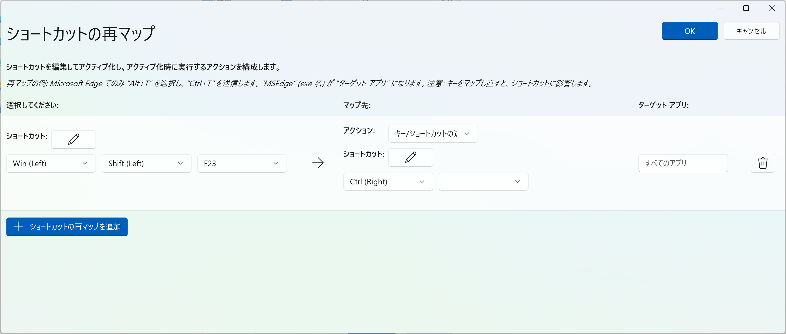

## はじめに

最近のWindowsノートPCのキーボードには、**Copilotキー**が搭載されていることがあります。キーボード下段の右側あたりに配置されていることが多いです。

このキーを押すと、Windows Copilot（AIアシスタント）が起動するのですが、コードを書いていて右手でをしたいのにできない…ということが頻発します。

本記事では、**MicrosoftのPowerToysに搭載されているKeyboard Manager**を使って、CopilotキーをCtrlキーに置き換える方法を紹介します。

:::{.callout-note}
## 動作環境
- Windows 11
- PowerToys（インストール方法は後述）
:::

## PowerToysとは

[PowerToys](https://learn.microsoft.com/ja-jp/windows/powertoys/)は、**Microsoftが公式に提供しているWindows向けのユーティリティツール集**です。キーボードのカスタマイズ、ウィンドウ管理、ファイル一括リネームなど、Windowsをもっと便利に使うための多彩な機能が詰まっています^[あまりに便利なのでまた別に便利な機能を紹介したいと思います！]。

今回はその中の**Keyboard Manager**という機能を使います。これは任意のキーを別のキーに割り当て直すことができる機能です。

## PowerToysのインストール

PowerToysはMicrosoft Storeからインストールできます。

1. スタートメニューを開き、**Microsoft Store**を検索して起動する
2. 検索バーに「PowerToys」と入力する
3. 「Microsoft PowerToys」を選択して**インストール**する

または、以下のコマンドをPowerShellやコマンドプロンプトから実行してもインストールできます^[wingetはWindows 10 1709以降・Windows 11で利用可能です。]。

```powershell
winget install Microsoft.PowerToys
```

## キーの置き換え手順

### 1. PowerToysを起動する

インストール後、スタートメニューから**PowerToys**を検索して起動します。タスクバーのシステムトレイ（通知領域）にアイコンが表示されている場合は、そこからも開けます。

### 2. Keyboard Managerを開く

PowerToysのホーム画面左サイドバーから、**Keyboard Manager**を選択します（「入出力」のカテゴリ内にあります）。

### 3. 「ショートカットの再マップ」を設定する

Keyboard Managerの画面で、**「ショートカットの再マップ」**をクリックします。

### 4. CopilotキーをCtrlキーに割り当てる

「ショートカットの再マップ」ダイアログが開いたら、以下の手順で設定します。

1. 左側のをクリックする
2. 実際にCopilotキーを押し、**Win (Left) + Shift(Left) + F23**と表示されることを確認する
   - 内部的にはCopilotキーはこのように認識されています。
3. 真ん中の列の1番下にあるドロップダウンから**Ctrl (Right)**を選択する
4. 右上の**「OK」**をクリックして保存する



### 5. 動作を確認する

設定後、メモ帳などを開いて**Copilotキー + C**でコピー、**Copilotキー + V**でペーストができるか試してみてください。Ctrlキーとして機能していれば成功です。

:::{.callout-note}
PowerToysが起動している間だけキーの再マップが有効になります。PowerToysはデフォルトでWindows起動時に自動起動するよう設定されているので、通常は意識しなくて大丈夫です。

自動起動の設定は、PowerToysの**全般**タブ > **起動時に実行**で確認・変更できます。
:::

## まとめ

今回紹介した方法を使えば、CopilotキーをCtrlキーとして使えるようになります。これで右手でができるようになり、コードのレビュー中、左手で頬杖をつきながらコードを実行できるようになります😊

コードを書くときのストレスが減るはずです！是非お試しあれ。
