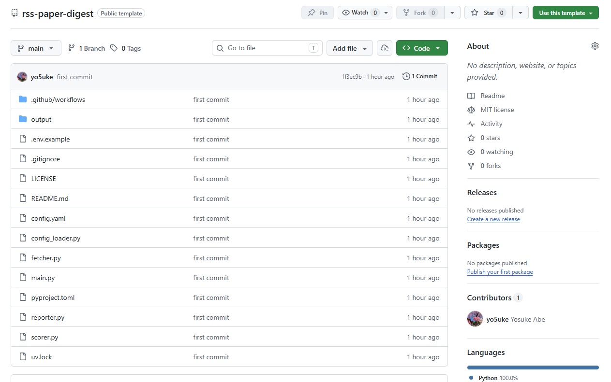
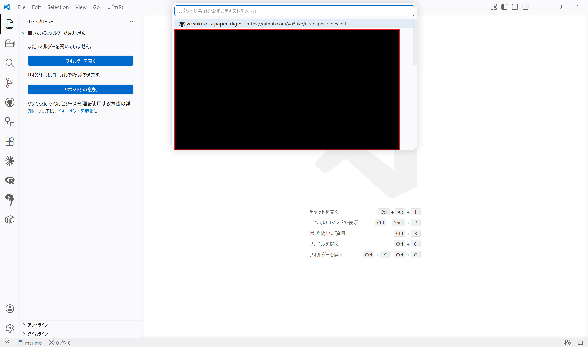
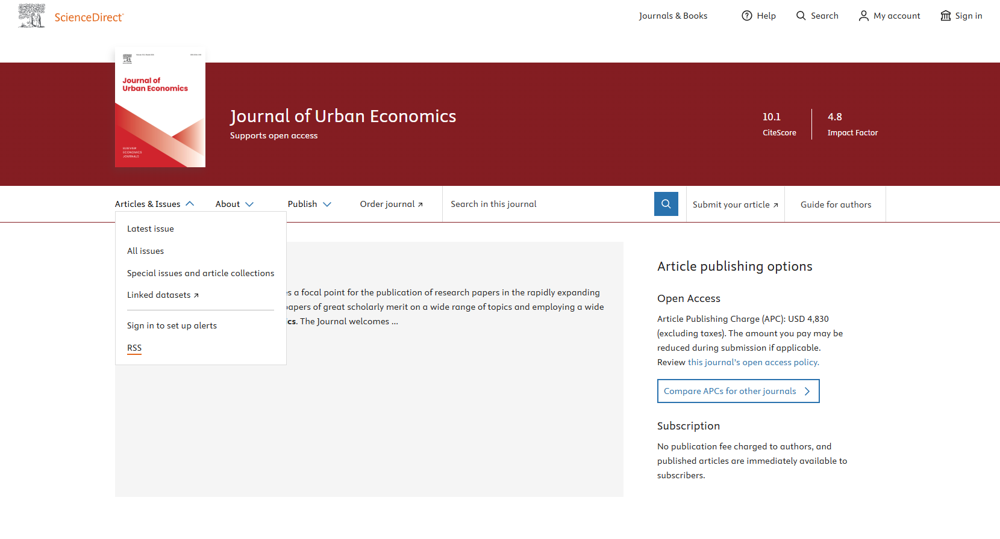

:::{.callout-note}
[Software](/pages/software/index.qmd)ページに本ツールを追加しました！
:::

## はじめに

研究者の方々にとって最新の研究動向をキャッチアップすることは重要だと思いますが、研究者志望でない学生や日々忙しい社会人の方々にとってはなかなか大変なことではないでしょうか。

自分も重要なトピックに関しては追いかけたいと思っているのですが、仕事が終わって家のこともいろいろある中で実際に興味ある論文を読んでいくのは厳しいと感じていました。

そこで、**Claude APIを使ってRSSフィードから論文を自動取得し、自分の関心にマッチした論文を選んで要約してくれるツール**を作ってみました。

お金は若干かかるのですが、Claudeの試算によれば$5の課金で3か月は十分に使えるとのことなので、コーヒー1杯で1か月と思えばかなりコスパがいいのではないかと思います^[モデルを変更すればもっとお得に使うことも可能です。]。

## ツールについて

ツールは以下のGitHubリポジトリで公開しています。



config.yamlを書き換えるだけで、任意の研究分野・ジャーナルに対応可能です。GitHub Actionsによる定期実行にも対応しています。

## コンセプト

本ツールのコンセプトは以下の通りです。

- RSSフィードから論文を自動取得
- Claude APIで自分の研究関心との関連度スコアリングと日本語要約を実行
- Markdownダイジェストを生成
- 自分の関心に沿った論文を優先的に読むことが可能に

RSSフィードになじみがない方も多いかと思いますが、RSSフィードは**論文のタイトルや要約、URLなどのメタデータを定期的に提供してくれる仕組み**で、これを利用することで自動的に最新の論文情報を取得することができます。

そもそもRSSリーダーというツールがあって、ブラウザの拡張機能やスマホアプリなどで利用できるのですが、結局のところ自分の関心にマッチした論文を選ぶのは自分なので、そこを自動化できないかと思って作ったのがこのツールです。

そもそもどういう論文から読み始めようという方や、時間がなくて最新の研究動向を追いかけるのが大変という方にとって、少しでも効率的に論文を選ぶ手助けになれば幸いです。

## 使い方

### 0-1. 事前準備 ― uvのインストール

本ツールではPythonを使いますが、uvというPythonのパッケージ管理ツールを使って環境構築を行います。

uvについては以下のページをご覧ください。



インストールはmacOS/Linuxであればターミナルから、WindowsであればPowerShellから以下のコマンドを実行してください。

:::{.panel-tabset}
## macOS/Linux
```bash
curl -LsSf https://astral.sh/uv/install.sh | sh
```

`curl`が使えない場合は以下のコマンドを試してください。

```bash
wget -qO- https://astral.sh/uv/install.sh | sh
```

## Windows
```powershell
powershell -ExecutionPolicy ByPass -c "irm https://astral.sh/uv/install.ps1 | iex"
```
:::

参考：[Installation | uv](https://docs.astral.sh/uv/getting-started/installation/)

### 0-2. 事前準備 ― Claude APIキーの取得

Claude APIを利用するためにはAPIキーが必要です。通常のClaudeの利用とは別に取得する必要があり、別々に課金されますが、片方をめっちゃ利用したからといってもう片方の利用が制限されることはないので、その点はご安心ください。

[Claude Console](https://platform.claude.com/)にアクセスして、アカウントを作成したうえでAPIキーを取得してください。最低化金額が$5なので、まずは$5から始めるのが良いのではないかと思います。

表示されたAPIキーは後でconfig.yamlに記入するので、控えておいてください。**2度表示できないので注意です。**

### 1. GitHubリポジトリの作成

まずは[GitHubリポジトリ](https://github.com/yo5uke/rss-paper-digest)の右上にある「Use this template」→「Create a new repository」をクリックして、自分のGitHubアカウントにリポジトリを作成してください。名前は任意で構いません。また、基本的にプライベートリポジトリで問題ありません。他の設定はデフォルトで。



## 2. クローンとセットアップ

リポジトリをクローンして、ローカルでセットアップします。

1. VSCodeのエクスプローラーから「リポジトリの複製」を選択し、作成したリポジトリを選択



2. VSCodeでクローンしたリポジトリを開き、ターミナルを開いて（）以下のコマンドを実行
    - これでPythonの仮想環境が作成され、必要なパッケージがインストールされます

```bash
uv sync
```

### 3. config.yamlの編集

config.yamlが主要な設定ファイルです。ここで、RSSフィードのURLや自分の研究関心を記述します。

```yaml
feeds:
  - "https://rss.sciencedirect.com/publication/science/00941190"
research_interests: |
  ここに自分の研究関心・業務領域を自由に記述してください。
```

主に編集するのは上記の2点で、`feeds`にRSSフィードのURLを追加していく形になります。

RSSフィードのリンクは論文の出版社やジャーナルのサイトから取得できます。例えばElsevierのJournal of Urban Economicsであれば、[ジャーナルのトップページ](https://www.sciencedirect.com/journal/journal-of-urban-economics)のArticles and IssuesからRSSフィードのURLを見つけることができます。



関心のあるジャーナルのページからRSSフィードのURLを見つけて、config.yamlの`feeds`に追加していってください。

研究関心の記述は、論文のタイトルや要約をもとに関連度スコアリングを行う際の基準になります。自分の研究関心や業務領域を自由に記述してください。なるべく具体的に書いた方が、関連度スコアリングの精度が上がると思います。

### 4. `.env`ファイルの編集

リポジトリには`.env.example`というファイルがあるので、これを`.env`として編集します。

```bash
cp .env.example .env
```

`ANTHROPIC_API_KEY=`の部分に、先ほど控えたClaude APIキーを貼り付けてください。

`.env`ファイルは`.gitignore`に含まれているのでGitHubにアップロードされることはありませんが、念のためAPIキーを他人に見られないように注意してください。

`.env.example`に記載してそのままにしていると誤ってAPIキーを公開してしまう可能性があるので、必ず`.env`にコピーしてから編集するようにしてください。

### 5. ツールの実行

ツールの実行には2通りの方法があります。

#### 5-1. ローカルでの実行

ローカルで実行する場合は、ターミナルで以下のコマンドを実行してください。

```bash
uv run main.py
```

これで、RSSフィードから論文を取得し、関連度スコアリングと要約が行われ、結果が`2026-05-01.md`のようなMarkdownファイルに出力されます。

また、APIを呼ばずにRSSフィードの取得を確認したい際には以下のコマンドを実行してください。

```bash
uv run main.py --dry-run
```

これは取得した論文タイトルとURLを一覧表示するだけで、関連度スコアリングや要約、マークダウンファイルの生成は行いません。動作確認に使えます。

#### 5-2. GitHub Actionsによる定期実行

こちらが本命です。GitHub Actionsを使って定期的にツールを実行することができます。

##### Secretsの設定

GitHubリポジトリのSettings → Secrets and variables → Actionsから、New repository secretを選択し、Nameに`ANTHROPIC_API_KEY`、Valueに先ほど控えたClaude APIキーを入力してAdd secretをクリックしてください。

##### スケジュールの設定

リポジトリには`.github/workflows/digest.yml`ファイルがありますので、これを編集してスケジュールを設定してください。

主に編集するのは以下の`cron`の部分です。

```yaml
on:
  schedule:
    # config.yaml で設定した頻度に合わせて cron を変更してください。
    # デフォルト: 月曜・木曜 08:00 JST (= 日曜・水曜 23:00 UTC)
    - cron: "0 23 * * 0,3"
  workflow_dispatch: # 手動実行
```

`cron`の書き方は少々ややこしいですが、「分 時 日 月 曜日」の順で指定します。"*"は指定しないことを意味しているので、月日に関しては特にしていません。曜日は0が日曜、1が月曜、...、6が土曜を表しているのですが、ここではUTCで指定する必要があることに注意してください。

記載内容をそのまま読むと「毎週日曜と水曜の23時に実行する」となるのですが、日本時間はUTCより9時間進んでいますから、実際には「毎週月曜と木曜の8時に実行する」ということになります。この点を考慮して設定してください。

## 3. 出力結果

ツールを実行すると、以下のようなMarkdownファイルが出力されます。

```markdown
# 📚 Journal Digest — 2026-04-27

## ⭐⭐⭐⭐⭐ 必読（score: 5）

**[ScienceDirect Publication: Regional Science and Urban Economics] The fiscal consequences of special district consolidation: Evidence from California**
📝 カリフォルニア州の特別区統合（consolidation）が財政に与える影響を実証分析。自治体合併・財政統合の効果検証として研究関心と非常に高い関連性がある。
💡 特別区統合の財政的影響を実証、municipal merge
🔗 https://www.sciencedirect.com/science/article/pii/S0166046226000384?dgcid=rss_sd_all

## ⭐⭐⭐⭐ 読む価値あり（score: 4）

**[ScienceDirect Publication: Regional Science and Urban Economics] Does decentralization improve allocative efficiency? Evidence from the Province-Managing-County Reform in China**
📝 中国の省管県改革を用いた地方分権化が資源配分効率に与える影響を分析。準実験的手法による政策評価で、地方自治体改革の実証研究として関連性高い。
💡 地方分権改革の効果検証で財政・地域政策に関連
🔗 https://www.sciencedirect.com/science/article/pii/S0166046226000402?dgcid=rss_sd_all

**[ScienceDirect Publication: Journal of Urban Economics] Selective migration and regional decline: Evidence from coal country**
📝 石炭産業地域からの選択的移住が地域衰退に与える影響を実証分析。内部移住・人口動態・地域格差の研究として研究関心と高い関連性がある。
💡 選択的移住と地域衰退の関係を実証、関心に合致
🔗 https://www.sciencedirect.com/science/article/pii/S009411902600029X?dgcid=rss_sd_all

**[ScienceDirect Publication: Journal of Urban Economics] The determinants of declining internal migration**
📝 米国における国内移住の長期的な低下傾向の決定要因を実証分析。internal migrationの研究として、人口動態・地域経済の観点から研究関心と高い関連性がある。
💡 国内移住の低下要因を分析、人口動態研究に直結
🔗 https://www.sciencedirect.com/science/article/pii/S0094119026000276?dgcid=rss_sd_all

**[ScienceDirect Publication: Research Policy] Research excellence is hard to sustain: Evidence from Japan's WPI initiative**
📝 日本のWorld Premier International Research Center Initiative（WPI）を対象に、研究卓越性の持続可能性を実証的に検証した論文。日本のSTI政策・研
💡 日本のWPI研究卓越拠点の持続性を実証分析
🔗 https://www.sciencedirect.com/science/article/pii/S0048733326000843?dgcid=rss_sd_all
```

このように、論文のタイトル、関連度スコア、要約、URLがMarkdown形式で出力されます。関連度スコアは5段階評価で、5が最も関連性が高いと判断された論文になります。関心の記載内容やモデルの選択によってスコアリングの精度は変わってくると思いますので、config.yamlの記述を工夫してみてください。

## おわりに

今回はRSSフィードから論文を自動取得し、Claude APIで関連度スコアリングと要約を行うツールを紹介しました。

少額の課金で自分の関心にマッチした論文を優先的に読むことができるようになるので、学生や非研究者の方々にとっても最新の研究動向を効率的にキャッチアップする手助けになればうれしく思います。


